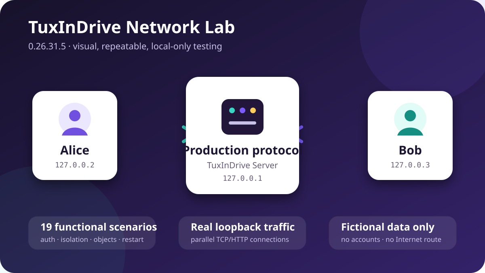

# TuxInDrive Network Lab



TuxInDrive Network Lab is a separately released Linux application for repeatable
local server/client networking tests. It opens its own resizable window, creates
a private temporary sandbox, starts the production TuxInDrive HTTP server on an
ephemeral `127.0.0.1` port, creates two fictional tenants and executes the
scenario matrix automatically. A live progress bar shows the percentage,
completed/total scenario count and the scenario most recently reported; it
remains at the reached position when a run is cancelled. A topology panel
visualizes Alice, the server and Bob, changes color with activity/results and
reports the real loopback connection and byte counts.

It is not part of the normal desktop/server update channel. Network Lab releases
use tags such as `network-lab-v0.26.31.5`; Debian package versions use the form
`0.26.31+lab5`. This prevents a test package from replacing the desktop client or
self-hosted server.

## Safety boundary

- The listener is hard-coded to IPv4 loopback and an OS-selected port.
- The headless synchronization agent is disabled.
- No desktop configuration, provider account, credential store, synchronized
  folder, real hostname or Internet endpoint is loaded.
- Payloads, device names, users and workspaces are fictional and bounded.
- The SQLite sandbox is removed after a run unless `--keep-sandbox` is selected.
- Results contain no bearer tokens or opaque payload contents. Directories and
  log files use private `0700` and `0600` permissions.

Network Lab tests the application protocol and local lifecycle. It does not
claim to emulate a real cloud provider, Internet latency/loss, NAT traversal,
public TLS certificate deployment, kernel/FUSE behavior or physical bandwidth.
Those remain part of the manual release matrix.

## Automated scenarios

1. loopback binding and production-data isolation;
2. unauthenticated public health probe, authenticated private health and HTTP
   security headers;
3. valid/invalid authentication and capability reporting;
4. mailbox delivery and acknowledgement;
5. mailbox routing between fictional devices and missing acknowledgement;
6. content-addressed object retrieval and tenant isolation;
7. same-tenant object deduplication and malformed digest rejection;
8. rendezvous-envelope replacement;
9. ordered collaboration operations;
10. mailbox, collaboration and rendezvous tenant isolation;
11. complete Alice/Bob workflow: presence, invitation, shared object, edit and
    acknowledgement;
12. rejection of traversal-like identifiers, malformed base64 and empty data;
13. disabled agent, relay and attestation endpoints;
14. MCP initialization, read-only tools and rejected invented mutation;
15. concurrent bounded fictional clients;
16. two real parallel HTTP connections sourced from `127.0.0.2` and
    `127.0.0.3`, transferring and reading fictional 128 KiB blocks through the
    production server on `127.0.0.1`;
17. audit events and storage statistics;
18. tenant quota exhaustion while server health and another tenant continue;
19. clean restart and durable opaque-object retrieval.

A failed scenario is retained and later independent scenarios continue whenever
possible, providing more useful diagnostics than stopping at the first error.

The multi-address scenario uses real local sockets rather than a mocked
transport. Alice and Bob bind their client connections to `127.0.0.2` and
`127.0.0.3`, send parallel HTTP requests to the ephemeral production server on
`127.0.0.1`, then validate the returned object bytes and digests. The displayed
connection and byte counters are observations from that run; their exact byte
total can vary with protocol framing and must not be presented as a bandwidth
benchmark.

## Install and run

Download the `.deb` from the separate **TuxInDrive Network Lab** GitHub release:

```bash
sudo apt install ./tuxindrive-network-lab_0.26.31+lab5_all.deb
```

Open **TuxInDrive Network Lab** from the application menu. For automation:

```bash
tuxindrive-network-lab-cli --json
tuxindrive-network-lab-cli --output-dir ./lab-results --keep-sandbox
```

Private human, JSONL and summary logs are stored below
`$XDG_STATE_HOME/tuxindrive/network-lab/<UTC-run>/` (normally
`~/.local/state/tuxindrive/network-lab/`). Attach `summary.json` and the JSONL log
to a bug report after reviewing them; neither file should contain credentials or
fictional opaque data.

## Build and release

```bash
PYTHONPATH=src python3 -m unittest -v tests.test_network_lab
TUXINDRIVE_LAB_REVISION=5 sh scripts/build-network-lab-deb.sh
```

The dedicated workflow builds on manual dispatch. A maintainer publishes a
separate release by pushing `network-lab-v<application-version>.<revision>`.
